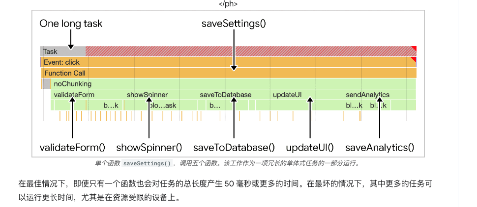
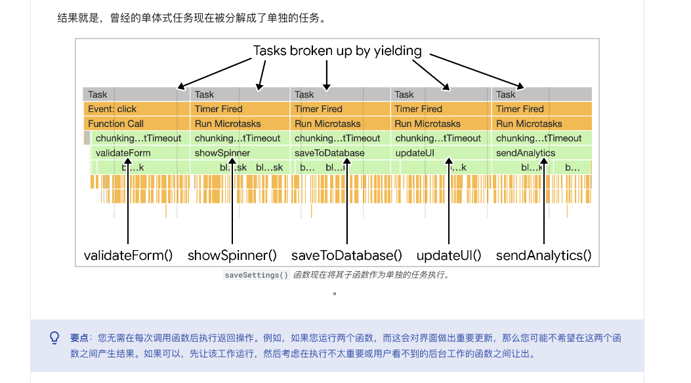
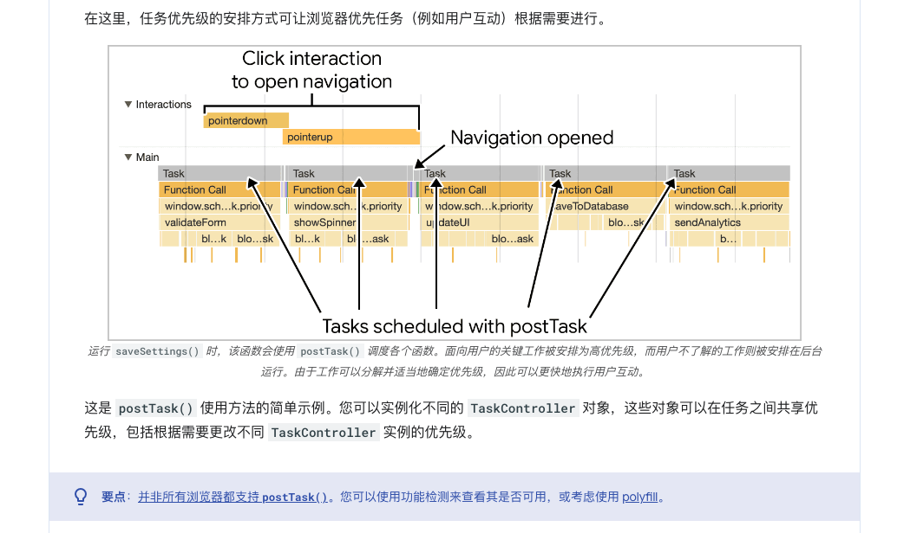
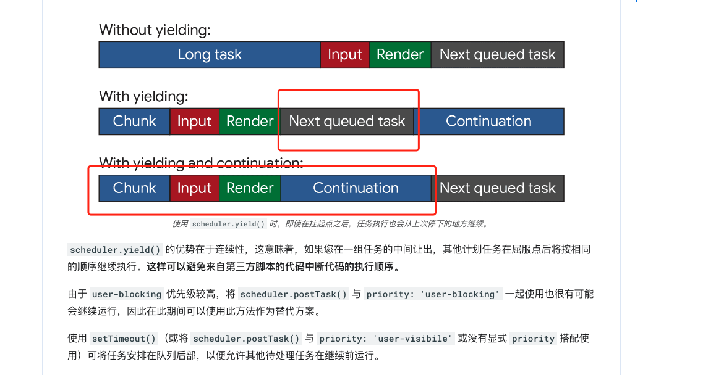

# 优化耗时较长的任务

## 前提
- JS（除了web worker）运行在浏览器的主线程上
- 单线程。主线程一次只能处理一个任务。

## 相关指标
- 任何耗时超过 50 毫秒的任务都属于耗时较长的任务。

## 建议
- 勿阻塞主线程
- 将冗长的任务分门别类

## 影响的方面
- 当浏览器在启动过程中下载 JavaScript 文件时，会将任务排入队列，以解析和编译该 JavaScript，以便稍后执行。
- 在页面生命周期的其他时间，当 JavaScript 起作用时（`例如通过事件处理程序、JavaScript 驱动的动画和后台活动（例如 Analytics 收集）驱动互动`），系统会将任务排入队列。

## 思路

- 在上图的顶部，由用户互动排入队列的事件处理程序必须等待一个长任务才能开始，这就延迟了互动的发生。在这种情况下，用户可能已注意到延迟。在底部，事件处理脚本可以更早开始运行，用户可能感觉到即时互动。

# 例子

## 初始版本
```js
function saveSettings () {
  validateForm();
  showSpinner();
  saveToDatabase();
  updateUI();
  sendAnalytics();
}
```
1. `saveSettings()` 具有良好的架构。如果您需要调试其中某个函数，可以遍历项目树来确定每个函数的用途。像这样拆分工作会使项目更易于导航和维护。
2. 这里的潜在问题是，JavaScript 不会将每个函数作为单独的任务运行，因为它们是在 `saveSettings()` 函数中执行的。也就是说，这五个函数都将作为一个任务运行。


## 手动推迟代码执行
```js
function saveSettings () {
  // Do critical work that is user-visible:
  validateForm();
  showSpinner();
  updateUI();

  // Defer work that isn't user-visible to a separate task:
  setTimeout(() => {
    saveToDatabase();
    sendAnalytics();
  }, 0);
}
```
1. 缺陷：
   - 您可能有大量数据需要通过循环处理，并且如果迭代次数很多，则该任务可能需要很长时间。
   - 使用 setTimeout() 会出现问题，即使每次迭代都运行很快，整个数据数组也可能需要很长时间进行处理。（developer ergonomics 开发者工效学）
   - 有一个缺点：当您通过推迟在后续任务中运行代码来让出主线程时，该任务会被添加到队列的末尾。


## 使用 async/await 放到微任务执行
```js
function yieldToMain () {
  return new Promise(resolve => {
    setTimeout(resolve, 0);
  });
}

// main
async function saveSettings () {
  // Create an array of functions to run:
  const tasks = [
    validateForm,
    showSpinner,
    saveToDatabase,
    updateUI,
    sendAnalytics
  ]

  // Loop over the tasks:
  while (tasks.length > 0) {
    // Shift the first task off the tasks array:
    const task = tasks.shift();

    // Run the task:
    task();

    // Yield to the main thread:
    await yieldToMain();
  }
}
```


## 专用的调度器 API scheduler.postTask

- 更精细地调度任务，是帮助浏览器确定工作的优先级.
    - 'background' 表示优先级最低的任务。
    - 'user-visible'，适用于中优先级任务。如果未设置 priority，则这是默认值。
    - 'user-blocking'（适用于需要以高优先级运行的关键任务）。


## 内置收益，可使用即将推出的 scheduler.yield() API 实现延续

- 该 API 专为让浏览器中的主线程而设计,类似于本指南前面演示的 yieldToMain() 函数

```js
async function saveSettings () {
  // Create an array of functions to run:
  const tasks = [
    validateForm,
    showSpinner,
    saveToDatabase,
    updateUI,
    sendAnalytics
  ]

  // Loop over the tasks:
  while (tasks.length > 0) {
    // Shift the first task off the tasks array:
    const task = tasks.shift();

    // Run the task:
    task();

    // Yield to the main thread with the scheduler
    // API's own yielding mechanism:
    await scheduler.yield();
  }
}
```


## 不使用 isInputPending()
- 有了对任务的处理的理解后，不再建议使用此 API，而是建议执行生成操作，无论输入是否处于待处理状态。
- 动画 `isInputPending` 监听不了。

## 结论
- 在面向用户的关键任务中让给主线程。
- 使用 postTask() 确定任务的优先级。
- 考虑使用 scheduler.yield() 进行实验。
- 最后，尽量减少在函数中执行的工作。