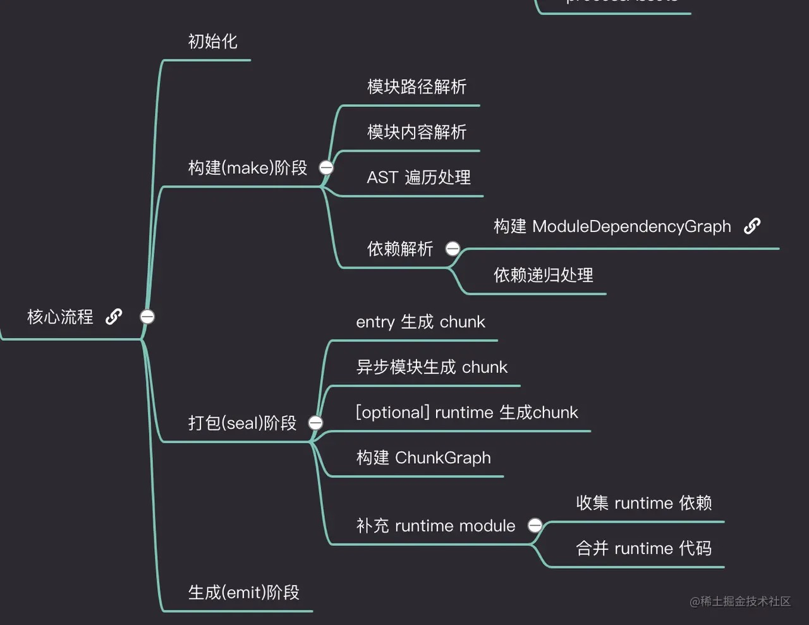

# chunk

- 每个 entry 项都会对应生成一个 chunk 对象，称之为 `initial chunk`
- 每个异步模块都会对应生成一个 chunk 对象，称之为 `async chunk`
- Webpack 5 之后，如果 entry 配置中包含 runtime 值，则在 entry 之外再增加一个专门容纳 runtime 的 chunk 对象，此时可以称之为 `runtime chunk`

# 代码流程

