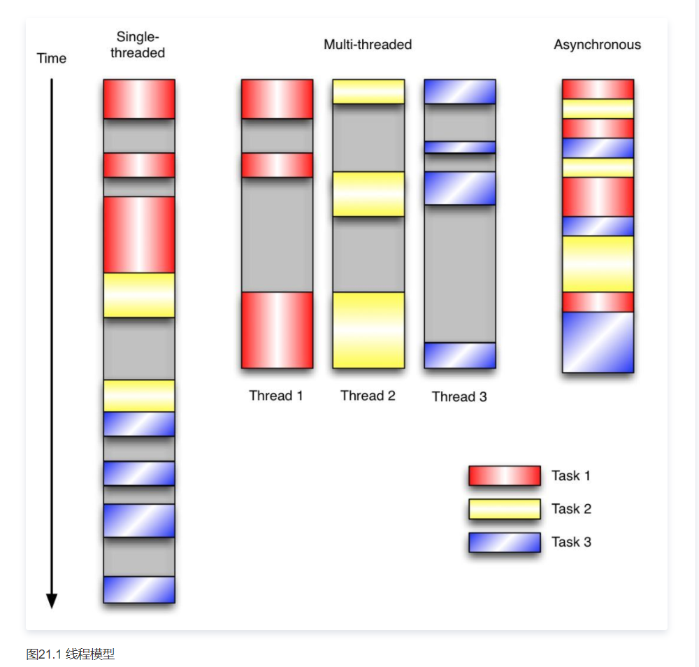

# 编程范式 - 程序执行流

## 单线程
  - 所有任务都按顺序执行，某个任务因为IO阻塞，所有任务都得暂停。

## 多线程
  - 由操作系统分配任务，并行处理，或者在单处理器上交错执行。但由于「线程之间共享数据和时间片」，使得多线程程序难以推断，不得不通过同步机制，如锁，可重入函数，线程局部存储来处理安全问题。

  - 优势：多核CPU下可以体现多核的性能。
  - 劣势：
    - 相对困难。
    -  一般不是线程安全的，内核调用
    - 线程之间共享时间片，数据。

## 事件驱动编程
  - 三个任务交替进行，并同处于一个线程中。在IO操作时执行其他的任务，等IO操作完通过回调来处理某个事件。相比多线程更容易推断行为。

  - 适用：多个任务时，并且任务之间高度独立「不需要互相通信，相互依赖」

  - 当应用程序需要在任务间共享可变的数据时，由于不需要用到同步处理。网络应用程序都有上述的特点，所以很好应用事件驱动编程模型。

  - 优势：
    - 简单，开发上，调试上；
    - 性能在大部分情况下优于多线程。
    - 事件驱动通常在IO框架中，很好实现IO复用

  - 劣势：
    - 每一个事件都会绑定一个handler，来实现具体的逻辑。如果占用CPU过长时间，会阻塞程序的响应。
    - 无法通过时间来维护本地状态，handler需要返回。
