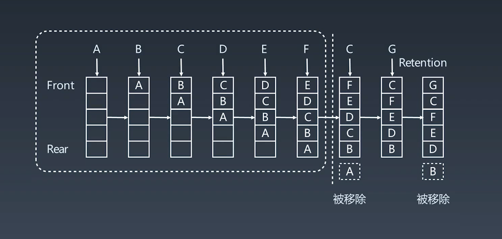

# 递归
- 向下进入不同的递归层，向上又回到原来一层。
- 通过函数参数来传递变量
- 在新的一层，除了参数其他的环境都是一份拷贝。（不会影响到其他层）


# 分治，回溯 - 递归
- 本质还是递归 - 最近重复性。

## 递归误区
- 抵制人肉递归
- 找重复子问题
- 数学归纳法, 当最简单的N成立,证明N + 1也成立,所以之后的结果也成立.

# 回溯
- 采用试错的思想，尝试分步解决问题，当不能得到有效的解答后，取消上一步或者上几步的计算。
- 反复重复（递归）之前步骤可能出现的两种情况：
  - 找到一个可能存在的正确答案。
  - 尝试了所有方法，最后宣告没有答案。

# 计算机操作
- if else, for, recursion
- 找最近 重复子问题

# 贪心 - 最优
- 每一步都选择当前状态下最好最优，导致某些情况下全局最好或者最优。
- 高效。但由于局限性，一般不能用来得到所需要的答案。可以用来解决一些要求不是很明确的问题。

## 与动态规划不同：
- 贪心会对于每个子问题都做出选择，不能回退（回溯）。
- 动态规划会保存以前的运算结果，根据以前结果进行选择，有回退功能。（最优判断 + 回退）

## 适用的场景
1. 问题能分为多个子问题来解决。
2. 子问题的最优解能递推到最终问题的最优解。（最优子结构）

# 二分查找

## 前提
- 目标函数的单调性（单调递增或递减）
- 存在上下界
- 能通过索引访问

# 动态规划（dynamic programming） - 求最优解

## 定义：
- 复杂的问题定义可以分解成多个简单的子问题，从而找到最优解。（通过递归的方式）
- 重点：分治 + 最优子结构

## 和分治的区别
- DP找的是最优解「存储于缓存里」，中途淘汰掉次优解。

## 关键点 - 思路
1. 分治：最优子结构：opt[n] = best_of(opt[n-1], opt[n-2], ...)
2. 状态数组定义：存储中间状态：opt[i] ⭐
3. DP方程：递推公式：状态转移方程，DP方程
  - fib: opt[i] = opt[n - 1] + opt[n - 2]
  - 二维路径：opt[i, j] = opt[i + 1][j] + opt[i][j + 1] // 同时需要判定a[i, j]是否为特殊情况

## 步骤
- 复杂问题转化为一个简单的子问题
- 猜递推方程
- 合并子问题的解merge
- 递推，记忆化（建立状态表）自底向上递推
- 解决


# trie 树 - 单词查找树，键树

- 通常用于统计和排序大量的字符串。词频统计，搜索等。
- 利用字符串公共前缀减低查询时间开销。
- 结合存储额外的信息，可以为用户做相应的推荐。

## 优点：
- 大限度的减少无关紧要的字符串的比较。
- 查询效率比哈希表高

## 基本性质
- 节点本身不存完整单词
- 根节点出发，连接起来就成为对应的字符串。
- 每个节点的所有子节点代表的字符都 `不相同` 。

# 位运算


## 异或的一些特点
```JS
x ^ 0 = x
x ^ 1s = ~x // 1s = ~0
x ^ (-x) = 1s
x ^ x = 0
c = a ^ b => a ^ c = b, b ^ c = a // 交换两个数
a ^ b ^ c = a ^ (b^c) = (a^c)^c
```

## 一些常规操作
- 需要对数的某个二进制位进行置1、清0、移位
```JS
x & (~0 << n) // 1. 将x最右边的N位清0
(x >> n) & 1 // 2. 获取x的第N位值（0或者1）
x & (1 << (n - 1))// 3. 获取x第N位的幂值
// ...
```
- 实战要点
```JS
// 1. 判断奇偶，判断最后一位是不是0，0则是偶数
  x & 1 == 1
  x & 0 == 0
// 2. (/ 2)，最后一位清空并移一位
  x >> 1
// 3. 清0最低位的1
  x = x & (x - 1)
// 4. 得到最低位的1
  x & -x
// 5. x & ~x => 0
```

## 剪枝

# 布隆过滤器 Bloom Filter

## 解决问题
- hash 表 + 拉链存储重复元素，「当需要判断元素存不存在一个表里时」，不需要存储所有的元素本身

## 特点
- 优点：空间效率和查询时间远远超过一般的算法
- 缺点：有一定的误识别率和删除困难「模糊查询」
- 二进制存储 + hash索引函数
- 用来作为查询时候的一层过滤

## 结论
当将元素全部插入进去布隆过滤器后，当他验证元素对应存在的二进制位为1时，我们只能说元素可能存在在过滤器里。但只要有一个二进制位位0时，他一定不存在。

## 应用
- 比特币网络
- 分布式系统
- redis 缓存
- 垃圾邮件，评论过滤

# LRU cache

## 特点
- 要点：大小，替换策略
- hash 表，双向链表
- O(1)查询, O(1) 修改更新
- 